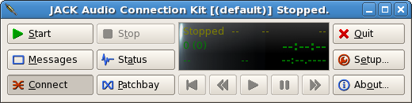
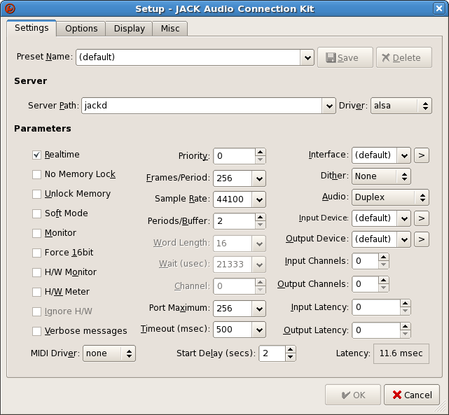
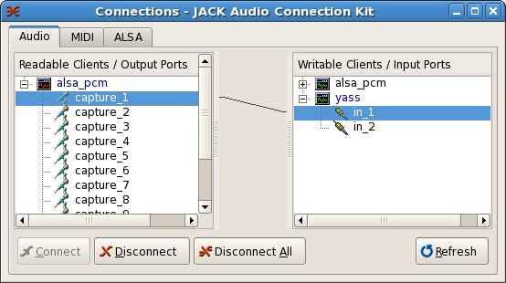
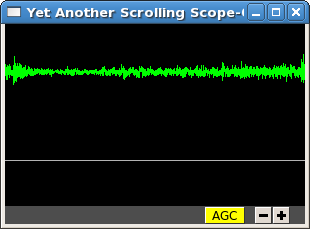

# Setting up JACK

This tutorial will show you how to start up the JACK server (or daemon) and plot input signals from a microphone or other source on a scrolling oscilloscope. Almost every computer comes with a sound card, which means you have a way of converting analog signals to digital bits that can be modified, visualized, or stored on disk.

You should have installed `qjackctl`, a graphical interface for controlling the JACK server and making connections between clients. Later we'll discuss how to do these tasks on the command line. The `qjackctl` interface initially looks like this:

To configure the JACK server, click `Setup`. A window with many configuration options will open. As shown in the figure, turn on Realtime, which should give the JACK daemon a high priority in the operating system's scheduler. Set the Frames/Period to something like 1024. Larger values will provide more buffering, but increase the latency between input, processing, and playback. For many applications, latency is less of a concern than buffer overruns and underruns (called *xruns* in JACK parlance) because those mean lost data.

The correct driver to select will depend on the machine. On linux machines, the correct choice is usually `alsa`; on OS X machines the correct choice is usually `coreaudio`. Close the setup window (with OK) and then click `Start` in the main interface. The display should show that the server is running along with some useful statistics.

## Adjusting input and output gain

The gain of your sound card's inputs and outputs can be set outside of JACK using a mixer. On Linux, the mixer can be accessed using the `alsamixer` command or one of the many graphical utilities that come with various desktop systems. If you don't see signals on inputs or hear sound on outputs, check that the gain for those channels is high enough.

## Making connections and visualizing data

JILL/JACK modules communicate with each other through ports. There are input ports and output ports, and you can make connections from outputs to inputs to move data around. When it starts up, the JACK daemon will create input and output ports corresponding to the outputs and inputs of the sound card. This section demonstrates making a connection between a sound card input (or capture port) and a third-party visualization program, `yass`.

Start `yass` at the command line (e.g. `yass &`). By default, `yass` will create two graphs, which can be connected to one or more output channels. Initially the plots will be gray, indicating that there isn't any signal. Click 'Connect' in `qjackctl` to open up an interface for making connections:

To make a connection, select an output and an input port and click 'Connect'. In the figure above I've connected the first capture channel of the soundcard to the first channel of yass. If the channel is hooked up to a microphone or other sound source, the yass plot will show its activity, as below.

Note that you can connect multiple output ports to the same input port, in which case the inputs will be *mixed*: the data from the output ports will be added together, and this sum will appear in the input port. The same output port can be connected to multiple input ports.
