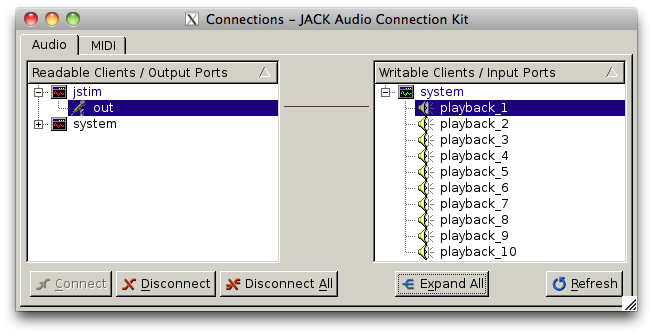

# Stimulus presentation

This tutorial demonstrates how to play audio stimuli through playback ports of a sound card. There are a plethora of programs that can play sound files with JACK. **JILL** includes a module called `jstim` that's specialized for presenting a fixed list of stimuli multiple times in random order. It uses libsndfile (<http://www.mega-nerd.com/libsndfile>) and can read a lot of different formats. To play a single sound file repeatedly, run jstim as follows:

```shell
jstim -l <filename>
```

You'll see some messages on the console, but you shouldn't hear anything yet. That's because jstim hasn't been connected to any of the sound card playback ports. Switch to the Connection window in `qjackctl` and connect jstim:out to one of the system playback ports:



Of course, you can connect the output to as many ports as you like, and they will all receive the same input. Try connecting jstim:out to a yass input port. Stop `jstim` with `Ctrl-C`.

`jstim` has lots of options for controlling the order and timing of stimulus playback, which you can see by running `jstim --help` (all of the **JILL** modules give help on how to run them this way). For example, to present all the wave files in the current directory, each 5 times, in random order, with gaps of 5 s:

```shell
jstim -l -S -r 5 -g 5 *.wav
```

Finally, `jstim` can be instructed to connect to one or more output ports on startup, before it starts playing any stimuli. This command will play a stimulus one time on the first two playback ports:

```shell
jstim -o system:playback_1 -o system:playback_2 stimulus.wav
```
