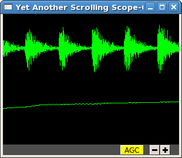
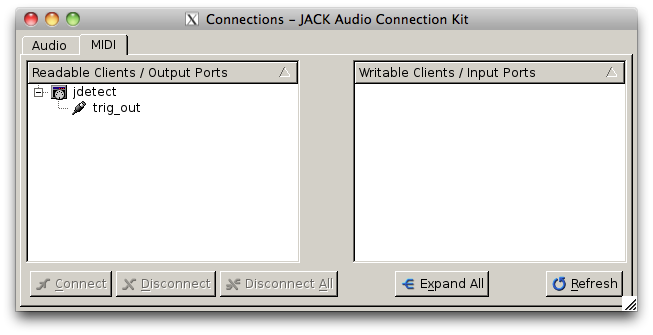

# Triggered recording

This tutorial will describe how to use `jrecord` to record in *triggered* mode, only saving data when an input signal rises above a certain level, or some other event of interest occurs.

Data sampled at relatively high rates can take up a lot of space. In JACK, data are stored as 32-bit floating point values, so an hour of data from a single channel at 48 kHz requires about 660 MB of uncompressed disk space. For many experimental designs you only want to record when something interesting is happening, so it would be nice to trigger recording on those interesting events.

The example we'll work with is recording songs over the course of a juvenile songbird's development. We'd like to start recording the bird when it starts singing, and stop when it's done. We'll detect when the bird is singing using the `jdetect` module, and use trigger events from `jdetect` to start and stop `jrecord`.

## Detecting the signal

The `jdetect` module uses a simple window discriminator to detect when an input's power rises above a certain level. It works by counting the number of times the signal crosses a threshold, maintaining a running count that's compared against another threshold. When the number of crossings in the analysis window (defined by the user) exceeds a threshold, the discriminator's 'gate' opens. Once the gate is open, the signal continues to be compared against a threshold (which can be different), and a separate running count is kept. Once the number of crossings drops below a certain number, the gate is closed.

There are a number of options for `jdetect` that are described in the program's help (`jdetect -h`). For now, we'll use the default settings. The `jdetect` program has three ports: an input port, an output port, and an optional status port. The input port receives the auditory signal; the output port emits events when the gate opens and closes. The status port is optional and can be disabled in normal operation. It gives a readout of the running threshold crossing count and is useful for setting thresholds.

To start up the `jdetect` module and connect its input to the first capture channel, run the following command:

```shell
jdetect -i system:capture_1 --count-port
```

The `--count-port` option will cause `jdetect` to create a status port where we can monitor the state of the detector. Now start `yass` and connect it to the status port of `jdetect` using qjackctl or the following shell command: `jack_connect jdetect:count yass:in_2`. The second channel of yass will now show the output of the integrator, as below. Make some noise and see what you get:



Note how the signal in the upper trace is associated with an increased in the state of the integrator. When the integrator crosses its threshold, the output port of `jdetect` will go high, and there will be a logged message, for example:

```
20130408T105856.109825 [jdetect] signal on:  frames=79373312, us=518609266225
20130408T105910.111175 [jdetect] signal off: frames=80038848, us=518623130887
```

The first set of numbers is a timestamp for the event, with microsecond precision if your platform supports it. `jdetect` also reports the frame count (a 32-bit unsigned integer internal to the JACK system) and a 64-bit microsecond-resolution timestamp (`us`).

You can test jdetect even if you don't have a bird or other animal to record, by playing a sound with `jstim` or any other JACK-aware application, and connecting the output to the `jdetect` input. For example:

```shell
jstim -o jdetect:in myfile.wav
```

This example demonstrates why the modular architecture of JACK can be so powerful.

### jdetect parameters

Choosing the optimal parameters for `jdetect` can be a bit tricky, so a few pointers:

- The open and close gates operate independently. If the open gate is too sensitive, it will trigger on transient noises. If it's not sensitive enough, it won't trigger even then when the animal is vocalizing. If the close gate is too sensitive, recording may stop during brief gaps in the vocalization. If it's not sensitive enough the recordings may not stop.

- The analysis granularity of both gates is controlled by the *period-size* option. Longer periods are more efficient; smaller periods carry more fine-grained temporal information.

- Each gate is controlled by three parameters: *X-thresh*, *X-rate*, and *X-period*. The average crossing rate must exceed (for opening) or drop below (for closing) `X-rate / (period-size * X-period)`. Crossing rate is related to the frequency and power of the signal.

- The integration time is determined by `period-size * X-period`. Longer integration times make the gates less sensitive to temporary dips or spikes in power, at some cost in sensitivity and temporal resolution.

- Another parameter to adjust is the gain of the sound card input, or the preamplifier for the microphone. Again, if you don't want to wait around for your bird to sing, you can make a continuous recording, clip out a song, and play it to `jdetect` until you've got the parameters right.

Once you've got a working set of parameters, it's a good idea to save them in a configuration file. For example:

```ini
name=bu38t
in=system:capture_1
open-thresh=0.015
open-rate=25
close-thresh=0.015
close-rate=10
```

A word on client names. Each client that's connected to the JACK daemon has to have a unique name. By default, **JILL** modules will use the name of the program when connecting to JACK. If you have multiple `jdetect` modules running at the same time, JACK will rename the clients using a sequential numbering scheme. You can also manually specify the client name using the `-n` command-line option, or in a configuration file, as above. Naming clients after the sound isolation box or animal in the box can help in making sense of complex connection graphs.

## Triggered recordings and JACK events

First, let's talk about the concept of event-time data. If you look at the JACK port list by running `jack_lsp`, you'll see that `jdetect` has an output port called `trig_out`. To see it in the `qjackctl` Connection window, you'll have to switch to the "MIDI" tab, which should look something like this:



MIDI is a well-established protocol for musical devices to communicate about event times. If you push the key for middle C on a MIDI keyboard, the keyboard doesn't generate the sound. Instead, it sends a short message on the MIDI bus that indicates what key was pressed and when. A synthesizer that receives the signal translates the event into an actual sound.

JACK can route MIDI events between clients in its real-time framework, and **JILL** modules use this mechanism to exchange information about event times. These signals aren't intended for use with real MIDI devices, and the internals of how the signals are passed aren't important. What's important is that audio ports carry sampled data, and can only be connected to other audio ports, whereas MIDI ports carry event data, and can only be connected to other MIDI ports.

If `jrecord` is run in triggered mode, it creates an event input port that can be connected to any event output port. For example:

```shell
jrecord -t jdetect:trig_out -I pcm <filename>
```

`jrecord` will output messages indicating that it's started up and connected to the ports we specified, but it won't start recording until `jdetect` sends it a signal to start. The `-I` flag tells `jrecord` to create an input port called `pcm`, but not to connect it to anything. Now play a stimulus with `jstim`:

```shell
jstim -l -g 5 -o jdetect:in -o jrecord:pcm <filename>
```

The `-g` flag tells `jstim` to wait 5 s between stimuli. You should start to see a series of log messages like this:

```
20130524T145926.060274 [jdetect] signal on:  frames=682333184, us=785038875072
20130524T145933.626545 [jrecord] created entry: /jrecord_0006 (frame=682671232)
20130524T145933.630329 [jrecord] created dataset: /jrecord_0006/trig_in
20130524T145933.634015 [jrecord] created dataset: /jrecord_0006/pcm
20130524T145934.060868 [jdetect] signal off: frames=682695680, us=785046426702
20130524T145934.060960 [jdetect] signal on:  frames=682719232, us=785046917338
20130524T145936.375178 [jstim] next stim: bu49_ref_3x (3.04983 s)
20130524T145941.687170 [jrecord] closed entry: /jrecord_0006 (frame=683105280)
```

Notice how `jrecord` creates new entries each time there's a trigger. Each entry corresponds to an HDF5 group. You may notice that the frame counter for the beginning of the entry is *before* the frame count when `jdetect` reports detecting the start of the signal. How is this possible? Through the magic of prebuffering.

In triggered mode, when `jrecord` isn't writing samples to disk, it stores them in a buffer. The size of the buffer is controlled by the `--pretrigger` option. When the program receives an event indicating the start of a signal, it writes the data in the buffer to disk and then starts writing new data, so it can effectively look back in time and see what happened before the event. Why is this important? For one, the signal detection algorithm has some delay while it determines whether a sound is something interesting or a just a transient sound, but once you know a sound is interesting, you want to record the whole thing. Second, if you're interested in neural events that correlate with a behavior, you want to know what was happening in the brain both before and after the behavior occurred.

The `--posttrigger` option serves a similar function, but controls how much data is recorded after the offset trigger. The default is to record 1 second before an onset trigger until 0.5 s after the offset trigger. Finally, note that the pretrigger buffer only starts filling after recording stops, so if an onset event occurs before the buffer is filled, only the samples stored up to that point are written to disk.
